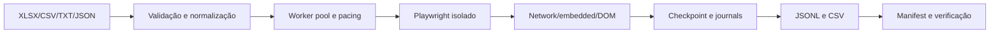

# Crawling Neogrid

[](https://github.com/mltlima/crawling-neogrid/actions/workflows/ci.yml)

CLI batch em Node.js/TypeScript para validar arquivos de URLs do iFood, coletar produtos com Playwright e gerar entregáveis JSONL/CSV verificáveis. Não é uma API HTTP. Não usa credenciais, stealth, proxies ou resolução de CAPTCHA.



## Requisitos e instalação

- Node.js 20.11 LTS, npm 10.8 ou Docker/Compose V2.
- Windows PowerShell, Linux e macOS são suportados.

```bash
npm ci
npx playwright install chromium
npm run validate
```

## Entrada e comandos

São aceitos `.xlsx`, `.csv`, `.txt` e `.json`. XLSX/CSV usam coluna `url` sem diferenciar maiúsculas; TXT usa uma URL por linha; JSON aceita strings ou objetos `{ "url": "..." }`.

```bash
npm run dev -- --help
npm run dev -- validate-input --input ./input/urls.xlsx --report ./artifacts/input-report.json
npm run dev -- probe-url --headed --url 'https://www.ifood.com.br/delivery/...?...'
npm run dev -- crawl --input ./input/urls.xlsx --concurrency 2 --min-request-interval 500 --checkpoint-dir ./artifacts/checkpoints/official --report ./deliverables/batch-report.json --output-jsonl ./deliverables/products.jsonl --output-csv ./deliverables/products.csv
```

Use `--resume` com a mesma entrada, seleção e diretório. `--force-unlock` só remove lock comprovadamente residual. O primeiro SIGINT/SIGTERM interrompe novas retiradas da fila e preserva o checkpoint; o segundo sinal registra solicitação imediata. `--headed` exibe o navegador. Trace fica desligado por padrão e pode conter dados temporários de sessão; nunca deve ser entregue sem revisão.

Exit codes: `0` para sucesso completo, `2` para processamento concluído com registros inválidos/falhos/pulados e `1` para erro operacional.

## Saída

Cada produto possui exatamente sete campos: `title`, `normal_price`, `discount_price`, `product_url`, `image_url`, `status` e `error_message`. Preços são inteiros em centavos. URLs duplicadas são preservadas na ordem original.

Estados incluem `PRODUCT_FOUND`, `PRODUCT_UNAVAILABLE`, `STORE_UNAVAILABLE`, `LOCATION_REQUIRED`, `REDIRECTED_TO_HOME`, `ACCESS_BLOCKED`, `RATE_LIMITED`, `NAVIGATION_TIMEOUT`, `HTTP_ERROR`, `PARSER_ERROR` e `UNKNOWN_PAGE_STATE`. Redirecionamentos e bloqueios permanecem falhas reais; nenhum produto é fabricado.

Retries seletivos cobrem timeout, 429, 5xx e desconexão real do browser. Pacing, concorrência, backoff e jitter são configuráveis. Falhas de URLs são registradas individualmente e não interrompem o restante do lote. A opção legada de circuit breaker é aceita por compatibilidade, mas não abre nem pula registros. Logs Pino são estruturados e diagnósticos têm URLs/tokens sanitizados.

## Docker e Compose

```bash
npm run docker:build
npm run docker:smoke
docker compose config
docker compose run --rm crawler --help
docker compose run --rm crawler validate-input --input /app/input/urls.xlsx
```

A imagem usa o Playwright 1.61.1 alinhado ao lockfile, executa como `pwuser`, não contém dependências de desenvolvimento nem materiais locais e recebe entrada somente leitura pelo Compose.

## Qualidade, benchmark e entrega

```bash
npm run validate
npm run audit
npm run benchmark:offline
npm run verify:output
npm run verify:delivery
npm run package:delivery
```

Testes e CI nunca acessam o iFood. O benchmark simula 1.000 itens offline e não representa latência live. `verify:output` compara entrada, JSONL, CSV, manifest, hashes, tamanhos, ordem e métricas. `verify:delivery` valida o pacote final e arquivos proibidos. O ZIP e SHA-256 ficam em `release/`.

## Segurança e limitações

O iFood pode redirecionar URLs para a home, exigir localização, limitar acesso ou retornar verificação humana. O crawler registra o estado e não tenta contornar controles. A taxa oficial é `sucessos / URLs selecionadas * 100`, incluindo falhas reais no denominador.

## Execução oficial atual

A execução oficial corrigida percorreu as 999 URLs: 65 `PRODUCT_FOUND`, 478 `REDIRECTED_TO_HOME`, 437 `ACCESS_BLOCKED` e 19 `UNKNOWN_PAGE_STATE`. Nenhum registro foi pulado; as 934 falhas possuem screenshots no diretório `failure-screenshots` do checkpoint. Os arquivos finais verificados estão em `deliverables/`.

Todas as 999 entradas são URLs estruturalmente válidas, mas somente 65 produtos puderam ser confirmados nessa execução. Os 478 redirecionamentos para a página inicial indicam que a URL do produto não estava mais acessível naquele momento, normalmente por item removido, loja indisponível ou rota expirada. Eles são reportados como falha, sem fabricar dados.

Os 437 resultados `ACCESS_BLOCKED` não comprovam que o link ou produto seja inválido. Nesses casos, a navegação recebeu HTTP 403 ou uma página de erro do Cloudflare antes que o produto pudesse ser verificado. O Cloudflare é a camada de proteção usada pelo site e pode negar uma requisição por regras de segurança, reputação ou volume de acesso. O crawler registra a falha e a evidência, sem tentar contornar essa proteção. Os 19 `UNKNOWN_PAGE_STATE` também permanecem inconclusivos.

Consulte [arquitetura](docs/architecture.md), [runbook](docs/runbook.md), [performance](docs/performance.md), [execução oficial](docs/execution-report.md), [auditoria do planejamento](docs/planning-completion-audit.md), [decisão de entrega](docs/adr/0007-containerization-and-delivery.md), [segurança](SECURITY.md) e [changelog](CHANGELOG.md).
